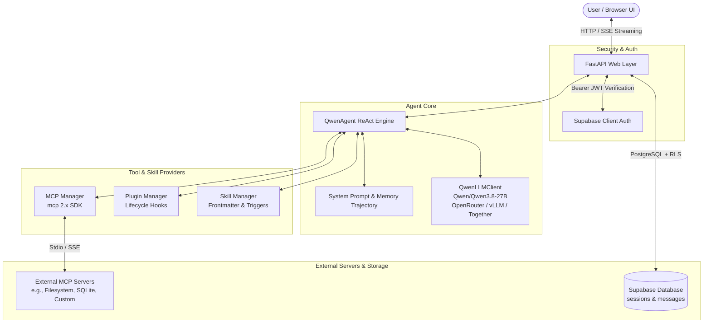

# 🪐 Qwen Agent: Autonomous AI Agent with MCP, Plugins, Skills & Supabase

[](https://python.org)
[](https://fastapi.tiangolo.com)
[](https://modelcontextprotocol.io)
[](https://supabase.com)
[](https://huggingface.co/Qwen)

A full-featured, production-ready autonomous AI Agent powered by **`Qwen/Qwen3.8-27B`**. Built with an extensible **ReAct reasoning loop**, native **Model Context Protocol (MCP)** client integration, modular **Python plugins**, dynamic **prompt-engineered skills**, **Supabase Client authentication & PostgreSQL persistence** with Row Level Security, and a responsive **Web UI dashboard with Server-Sent Events (SSE) streaming**.

---

## 📑 Table of Contents

- [Key Features](#-key-features)
- [System Architecture](#-system-architecture)
- [Project Directory Structure](#-project-directory-structure)
- [Prerequisites & Quickstart](#-prerequisites--quickstart)
- [Configuration & Environment (.env)](#-configuration--environment-env)
- [Supabase Setup & Row Level Security (RLS)](#-supabase-setup--row-level-security-rls)
- [Model Context Protocol (MCP) Integration](#-model-context-protocol-mcp-integration)
- [Plugins Architecture](#-plugins-architecture)
- [Skills System](#-skills-system)
- [API Reference](#-api-reference)
- [Web UI Dashboard](#-web-ui-dashboard)
- [Running Tests](#-running-tests)
- [Troubleshooting & FAQ](#-troubleshooting--faq)

---

## ⚡ Key Features

1. **Qwen/Qwen3.8-27B LLM Engine**
   - OpenAI-compatible client configured for `Qwen/Qwen3.8-27B`.
   - Compatible with OpenRouter, Together AI, HuggingFace Inference Endpoints, vLLM, and Ollama.
   - Streaming token support with asynchronous tool-call accumulation.

2. **Official Model Context Protocol (MCP) 2.x Client**
   - Connects to external tool servers via **Stdio** and **SSE** transports.
   - Dynamic tool discovery: automatically transforms MCP tool schemas into OpenAI function-calling format.
   - Seamless bidirectional dispatching and execution handling.
   - Ships with an out-of-the-box built-in Python MCP server (`mcp_servers/utility_server.py`).

3. **Modular Python Plugins System**
   - Object-oriented plugin framework (`BasePlugin`) with tool exposure and lifecycle hooks:
     - `on_before_agent_run`: intercepts and preprocesses user prompts.
     - `on_after_tool_call`: inspects, audits, or modifies tool outputs.
     - `on_after_agent_run`: post-processes agent responses.
   - Built-in plugins:
     - `SystemToolsPlugin`: Safe mathematical expression evaluator, web page fetcher, UUID generator.
     - `MemoryToolsPlugin`: Key-value scratchpad for multi-turn cognitive reasoning.

4. **Dynamic Skills Architecture**
   - Markdown/YAML-based skill definitions (`skills/data/*.md`).
   - Trigger detection: automatically detects user intent and activates domain expertise.
   - Dynamic prompt injection into the system persona.
   - Pre-packaged skills: `Code Architect`, `Web Researcher`, `Data Analyst`.

5. **Supabase Client Authentication & Database**
   - Supabase JWT Bearer token authentication middleware.
   - Dual-mode support: Seamless **Guest/Demo mode** for instant local testing, plus **Full Supabase Auth** when credentials are provided.
   - Production PostgreSQL database schema with Row Level Security (RLS) ensuring each user only accesses their own conversations.

6. **Full-Stack Web Interface & Streaming API**
   - Glassmorphic, dark-mode web dashboard.
   - Real-time token streaming via Server-Sent Events (SSE).
   - Collapsible tool execution cards displaying inputs and outputs.
   - Session management (create, switch, delete chat threads).
   - Runtime configuration modal to update model keys and Supabase settings on the fly.

---

## 🏗️ System Architecture



---

## 📁 Project Directory Structure

```
D:/agy_projects/
├── .env.example                 # Environment configuration template
├── .env                         # Local environment configuration
├── config.py                    # Pydantic BaseSettings management
├── requirements.txt             # Project dependencies
├── main.py                      # Application entrypoint & FastAPI lifecycle
├── mcp_servers.json             # MCP server configuration (Claude/Antigravity style)
│
├── core/                        # Core Agent & LLM Engine
│   ├── __init__.py
│   ├── agent.py                 # Autonomous ReAct Agent Loop
│   ├── llm.py                   # OpenAI-compatible client for Qwen/Qwen3.8-27B
│   └── types.py                 # Data models (ChatMessage, ToolCall, ToolResult)
│
├── mcp_client/                  # Official Model Context Protocol Client
│   ├── __init__.py
│   └── manager.py               # MCP connection manager (Stdio & SSE)
│
├── mcp_servers/                 # Built-in or local MCP servers
│   └── utility_server.py        # Python MCP stdio server (time, hash, environment)
│
├── plugins/                     # Python Extensible Plugin System
│   ├── __init__.py
│   ├── base.py                  # BasePlugin class & lifecycle hook definitions
│   ├── manager.py               # Plugin registry & lifecycle dispatcher
│   └── builtin/
│       ├── __init__.py
│       ├── system_tools.py      # Math evaluation, web fetch, UUID generator
│       └── memory_tools.py      # Session scratchpad key-value storage
│
├── skills/                      # Prompt Skills System
│   ├── __init__.py
│   ├── manager.py               # Frontmatter parser & prompt injector
│   └── data/                    # Markdown skill definitions
│       ├── code_architect.md    # Software architecture & clean code rules
│       ├── web_researcher.md    # Research methodologies & citation rules
│       └── data_analyst.md      # Data analysis, SQL schemas, metrics
│
├── auth/                        # Supabase Authentication
│   ├── __init__.py
│   ├── supabase.py              # Supabase Client wrapper
│   └── middleware.py            # FastAPI JWT validation dependency
│
├── database/                    # Database & Persistence Layer
│   ├── __init__.py
│   ├── repository.py            # Chat session and message repository
│   └── schema.sql               # Supabase PostgreSQL schema with RLS
│
├── api/                         # REST & Streaming Routes
│   ├── __init__.py
│   ├── routes.py                # FastAPI routes (/api/chat, /api/auth, /api/mcp, etc.)
│   └── schemas.py               # Request/response validation schemas
│
├── static/                      # Web Dashboard Frontend
│   ├── index.html               # Responsive HTML5 interface
│   ├── style.css                # Dark-mode glassmorphism styling
│   └── app.js                   # Frontend application logic & SSE reader
│
└── tests/                       # Test Suite
    ├── test_agent_system.py     # End-to-end integration test
    └── test_api_endpoints.py    # FastAPI endpoint test
```

---

## 🚀 Prerequisites & Quickstart

### 1. Requirements
- **Python**: 3.10, 3.11, 3.12, 3.13, or 3.14
- **Node.js** *(Optional)*: Required only if running npm-based MCP servers (e.g. `npx @modelcontextprotocol/server-...`).

### 2. Setup Virtual Environment & Dependencies

```bash
# Clone or navigate to the project directory
cd D:/agy_projects

# Create a virtual environment
python -m venv .venv

# Activate the virtual environment
# On Windows (PowerShell):
.\.venv\Scripts\Activate.ps1
# On Linux / macOS:
source .venv/bin/activate

# Install all dependencies
pip install -r requirements.txt
```

### 3. Configure `.env`
Copy the template configuration file:
```bash
cp .env.example .env
```

Open `.env` and configure your API keys (see [Configuration section](#-configuration--environment-env)).

### 4. Launch the Application

```bash
python main.py
```
Or with Uvicorn directly:
```bash
uvicorn main:app --host 127.0.0.1 --port 8000 --reload
```

Once started, open your browser and navigate to:
- **Web UI Dashboard**: [http://127.0.0.1:8000](http://127.0.0.1:8000)
- **Interactive OpenAPI Documentation**: [http://127.0.0.1:8000/docs](http://127.0.0.1:8000/docs)

---

## ⚙️ Configuration & Environment (`.env`)

| Variable | Default Value | Description |
|---|---|---|
| `LLM_MODEL` | `Qwen/Qwen3.8-27B` | Model name / HuggingFace / OpenRouter identifier. |
| `LLM_BASE_URL` | `https://openrouter.ai/api/v1` | OpenAI-compatible endpoint (OpenRouter, Together, vLLM, Ollama). |
| `LLM_API_KEY` | *(empty)* | Your LLM provider API key. (If left blank, runs in local demo mode). |
| `LLM_TEMPERATURE` | `0.7` | Sampling temperature for the model. |
| `LLM_MAX_TOKENS` | `4096` | Maximum completion token budget. |
| `SUPABASE_URL` | `https://your-project.supabase.co` | Supabase project URL. |
| `SUPABASE_ANON_KEY` | *(empty)* | Supabase project anonymous / public API key. |
| `REQUIRE_AUTH` | `false` | When `false`, enables guest/local mode without requiring a login. Set to `true` for production. |
| `MCP_CONFIG_PATH` | `mcp_servers.json` | Path to the MCP server configuration file. |
| `HOST` | `127.0.0.1` | Host address to bind the server to. |
| `PORT` | `8000` | Port for the HTTP / WebSocket server. |
| `DEBUG` | `true` | Enable auto-reloading and detailed debug logs. |

### Using Local vLLM or Ollama
To run locally with vLLM or Ollama instead of a cloud API:
- **vLLM**:
  ```env
  LLM_BASE_URL=http://localhost:8000/v1
  LLM_API_KEY=dummy
  LLM_MODEL=Qwen/Qwen3.8-27B
  ```
- **Ollama**:
  ```env
  LLM_BASE_URL=http://localhost:11434/v1
  LLM_API_KEY=ollama
  LLM_MODEL=qwen2.5:32b
  ```

---

## 🗄️ Supabase Setup & Row Level Security (RLS)

The system is equipped with full Supabase client support for user signup, login, session management, and chat history persistence.

### 1. Execute SQL Schema
1. Open your [Supabase Dashboard](https://supabase.com/dashboard).
2. Go to the **SQL Editor** tab.
3. Paste the contents of [database/schema.sql](file:///D:/agy_projects/database/schema.sql) and click **Run**.

### 2. What the Schema Creates:
- **`public.sessions`**:
  - Chat threads mapped to `auth.users(id)`.
  - Row Level Security policies guaranteeing users can only read/write/delete their own sessions.
- **`public.messages`**:
  - Message history for each session, including role (`user`, `assistant`, `tool`), content, JSONB `tool_calls`, and `tool_results`.
  - Cascades deletions when a session is removed.

### 3. Supabase Client in Python
The application initializes the Supabase client via [auth/supabase.py](file:///D:/agy_projects/auth/supabase.py):
```python
from supabase import create_client
client = create_client(SUPABASE_URL, SUPABASE_ANON_KEY)
```
Protected endpoints verify tokens using the dependency `get_current_user` in [auth/middleware.py](file:///D:/agy_projects/auth/middleware.py).

---

## 🔌 Model Context Protocol (MCP) Integration

The agent connects to MCP servers using the official `mcp 2.x` SDK.

### Configuration (`mcp_servers.json`)
Servers are registered in `mcp_servers.json` using the standard JSON configuration:

```json
{
  "mcpServers": {
    "utilities": {
      "command": "python",
      "args": ["mcp_servers/utility_server.py"]
    },
    "filesystem": {
      "command": "npx",
      "args": ["-y", "@modelcontextprotocol/server-filesystem", "D:/agy_projects"]
    },
    "custom_remote": {
      "url": "http://localhost:8080/sse"
    }
  }
}
```

### How Tool Discovery Works:
1. At startup, [mcp_client/manager.py](file:///D:/agy_projects/mcp_client/manager.py) connects to each server.
2. It queries `session.list_tools()`.
3. Discovered tools are namespaced (e.g. `mcp__utilities__get_system_time`) and converted into standard OpenAI function definitions.
4. When Qwen outputs a tool call, the agent automatically routes execution to the corresponding MCP server session and feeds the result back into the agent context.

---

## 🧩 Plugins Architecture

Plugins provide a Pythonic way to add native tools and tap into agent lifecycle hooks.

### Creating a Custom Plugin

Create a new file in `plugins/` or subfolder (e.g., `plugins/custom_tools.py`):

```python
from plugins.base import BasePlugin
from core.types import AgentRunContext, AgentResponse, ToolResult

class CurrencyConverterPlugin(BasePlugin):
    name = "currency_converter"
    description = "Converts currencies using latest exchange rates"
    version = "1.0.0"

    def register_tools(self):
        self.add_tool(
            name="convert_currency",
            description="Converts an amount from one fiat currency to another.",
            parameters={
                "type": "object",
                "properties": {
                    "amount": {"type": "number", "description": "The amount to convert"},
                    "from_curr": {"type": "string", "description": "3-letter source currency (e.g. USD)"},
                    "to_curr": {"type": "string", "description": "3-letter target currency (e.g. EUR)"}
                },
                "required": ["amount", "from_curr", "to_curr"]
            },
            handler=self.convert
        )

    def convert(self, amount: float, from_curr: str, to_curr: str) -> str:
        # Implementation logic...
        return f"{amount} {from_curr} is approximately {amount * 0.92:.2f} {to_curr}"

    # Lifecycle hook: Inspect or alter user prompt before execution
    async def on_before_agent_run(self, context: AgentRunContext, user_message: str):
        return user_message
```

Register your plugin in [plugins/manager.py](file:///D:/agy_projects/plugins/manager.py):
```python
self.register(CurrencyConverterPlugin())
```

---

## 🎯 Skills System

Skills allow you to teach the agent specific domain knowledge and guidelines without writing code.

### Adding a New Skill

Create a markdown file in `skills/data/<skill_name>.md`:

```markdown
---
name: Cloud Security Auditor
description: Expert in cloud security posture, IAM least privilege, and compliance standards.
triggers: security, audit, iam, vulnerability, compliance, soc2, encryption
---
When this skill is active, adopt the role of a Senior Cloud Security Architect:
1. Check every proposed architecture for OWASP Top 10 vulnerabilities.
2. Enforce zero-trust network policies and mutual TLS (mTLS).
3. Validate that sensitive credentials are never hardcoded and use KMS/Vault.
4. Ensure all database columns storing PII are encrypted at rest.
```

The [SkillManager](file:///D:/agy_projects/skills/manager.py) will:
1. Automatically load and parse the YAML frontmatter and triggers.
2. Activate the skill whenever the user's prompt matches any trigger word (or when enabled in the UI).
3. Append the skill's instructions to the agent's system prompt during inference.

---

## 🌐 API Reference

### 🔐 Authentication
- `POST /api/auth/signup`: Create a user with email & password.
- `POST /api/auth/signin`: Authenticate and receive a Supabase JWT.
- `GET /api/auth/me`: Get the current user profile and auth state.

### 💬 Chat & Streaming
- `POST /api/chat`:
  - **Payload**:
    ```json
    {
      "message": "Check system time and calculate 2^16",
      "session_id": "optional-uuid",
      "skills": ["code_architect"],
      "stream": true
    }
    ```
  - **Stream (SSE)**: Yields real-time events (`session_init`, `token`, `tool_call`, `tool_result`, `skills_applied`, `done`).

### 📂 Sessions
- `GET /api/sessions`: List all conversation sessions for the current user.
- `POST /api/sessions`: Create a new session.
- `GET /api/sessions/{id}/messages`: Retrieve message history for a session.
- `DELETE /api/sessions/{id}`: Delete a session and its message trajectory.

### ⚙️ MCP, Plugins & Skills
- `GET /api/mcp/status`: Status of connected MCP servers and tools.
- `POST /api/mcp/reload`: Reconnect and refresh all MCP servers.
- `GET /api/plugins`: List active plugins and their tools.
- `POST /api/plugins/{name}/toggle`: Enable or disable a plugin.
- `GET /api/skills`: List all loaded skills.
- `POST /api/skills/{id}/toggle`: Enable or disable a skill.
- `POST /api/settings`: Dynamically update runtime model, API key, and base URL.

---

## 💻 Web UI Dashboard

The built-in web dashboard ([static/index.html](file:///D:/agy_projects/static/index.html)) provides:

- **Conversations Sidebar**: Easily switch, create, and delete conversations.
- **Specialized Skills Toggles**: Activate or deactivate skills with instantaneous UI feedback.
- **MCP Tool Status**: Shows live connected MCP servers and available tools.
- **Supabase Auth Modal**: Switch between Guest mode and logged-in Supabase user.
- **Settings Modal**: Quickly update model endpoint, temperature, or credentials without restarting the server.
- **Markdown & Code Highlighting**: Formatted code blocks with copy buttons and syntax coloring via Highlight.js.

---

## 🧪 Running Tests

The repository includes end-to-end integration tests:

```bash
# Run comprehensive agent and subsystem test
python tests/test_agent_system.py
```

This verifies:
1. Skill Manager loading, trigger detection, and prompt injection.
2. Plugin Manager tool discovery and safe execution.
3. MCP Manager stdio client connection and tool invocation.
4. Supabase Auth and Database repository persistence.
5. Autonomous ReAct agent multi-turn tool execution.

---

## ❓ Troubleshooting & FAQ

**Q: Can I use a model other than `Qwen/Qwen3.8-27B`?**  
A: Yes! You can change `LLM_MODEL` in `.env` or in the Settings modal (e.g., `qwen/qwen-2.5-72b-instruct`, `meta-llama/llama-3.3-70b-instruct`, etc.).

**Q: Do I need a paid Supabase account?**  
A: No. Supabase has a free tier, and this project runs seamlessly in **Guest/Local Mode** (`REQUIRE_AUTH=false`) if you don't configure Supabase keys.

**Q: How do I connect standard Node.js MCP servers?**  
A: Ensure Node.js is installed (`node -v`), then add the server to `mcp_servers.json`:
```json
"filesystem": {
  "command": "npx",
  "args": ["-y", "@modelcontextprotocol/server-filesystem", "D:/my_folder"]
}
```

---

## 📄 License

This project is licensed under the [MIT License](LICENSE).
